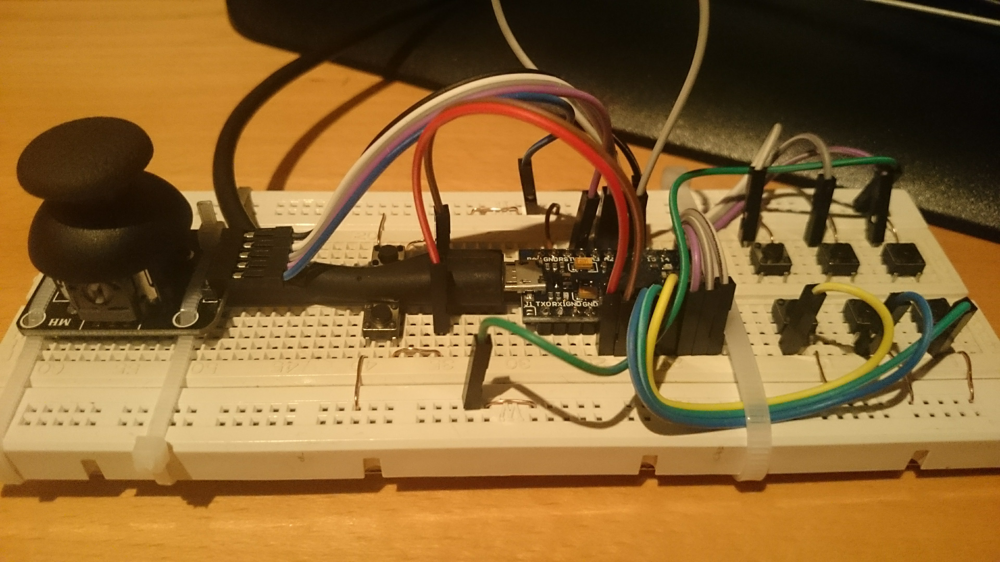
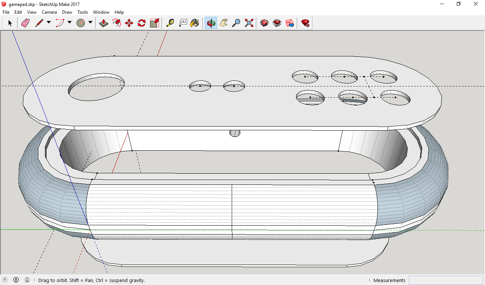

# Gamepad
Some files related to my gamepad build including an Arduino script for Leonardo/Pro Micro using the USB Joystick HID profile and a case design 3d model in Sketchup.
Check out this [video](https://youtu.be/WgcLccq3Ra8) of the first prototype in action.

